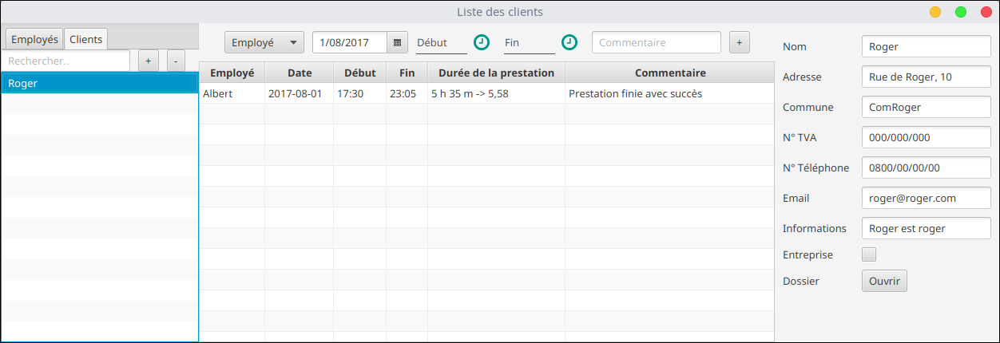
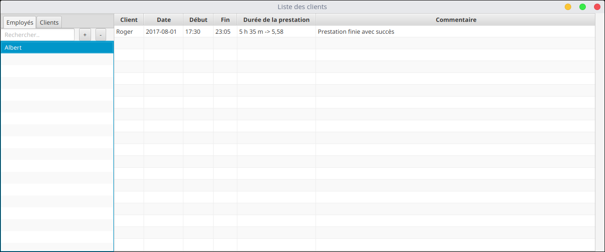
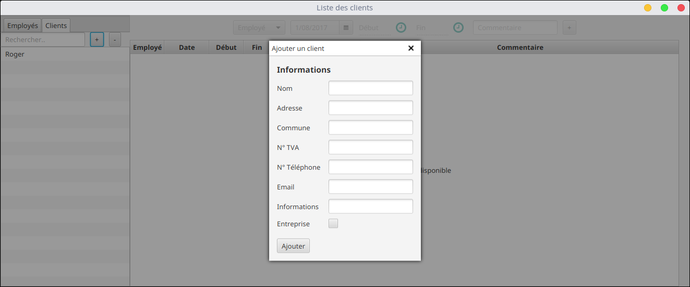

# ListClientFX
Ce programme permet de lister des prestations effectuées.
Il permet également de créer un répertoire pour chaque client ajouté et de pouvoir y accéder facilement.
Les prestations, les clients et les employés sont enregistrés au format *json* (Données non cryptées).

Programmer en **Kotlin** avec JavaFX + TornadoFX

----------------
# Licence : GNU GPL